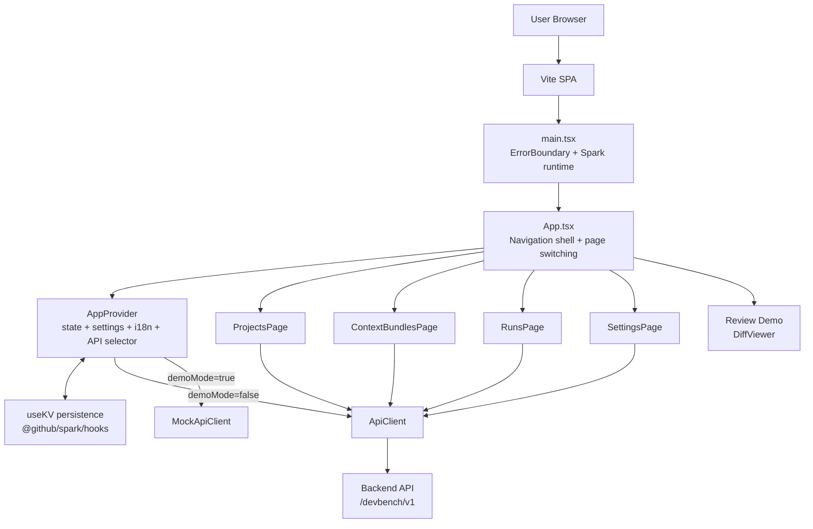
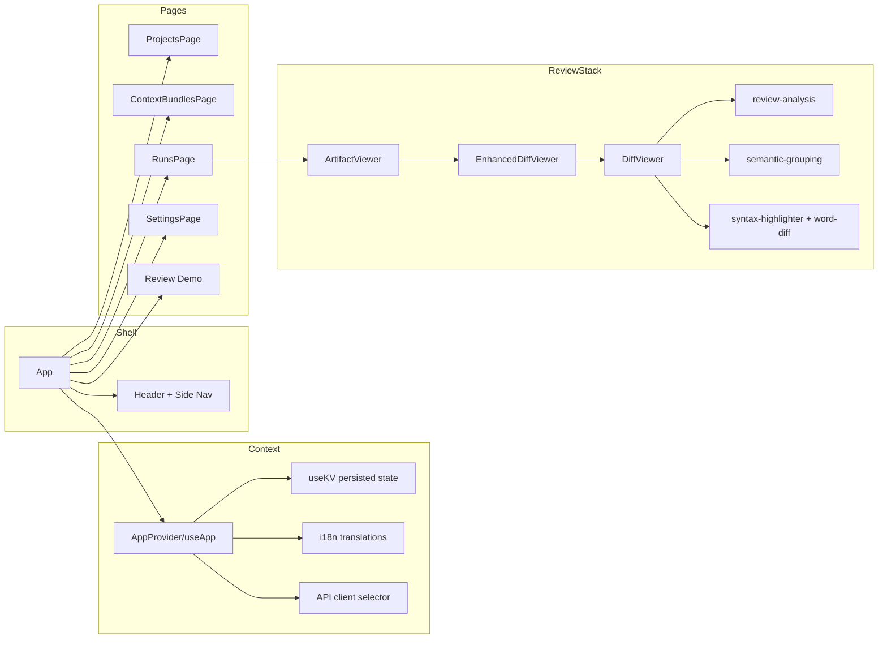
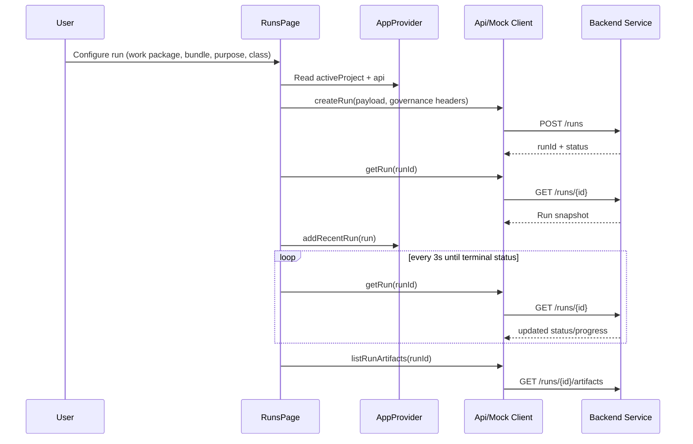

# EVA DevBench Architecture

This document describes the full front-end architecture for the `spark-template` application, including runtime boundaries, data flow, state model, and review-mode pipelines.

## 1) System Overview

EVA DevBench is a React + TypeScript single-page application built with Vite. It supports AI-assisted modernization workflows across four core user journeys:

1. **Projects**: create/select project context.
2. **Context Bundles**: package source/context inputs and finalize sealed bundles.
3. **Runs**: start and monitor AI work-package executions.
4. **Artifacts/Review**: inspect generated outputs, especially patch diffs with governance controls.

The app uses a context provider to centralize:
- persisted state (`activeProject`, `recentBundles`, `recentRuns`, `settings`),
- language translations (EN/FR),
- API client selection (live API vs mock API based on demo mode).

## 2) High-Level Runtime Architecture



## 3) Repository & Module Layout

- `src/main.tsx`: root render, `ErrorBoundary`, global styles, Spark runtime import.
- `src/App.tsx`: app shell, header/nav, page switching (`projects`, `bundles`, `runs`, `settings`, `review-demo`).
- `src/lib/app-context.tsx`: `AppProvider`, persisted app state, API selection, translation selection.
- `src/lib/types.ts`: canonical domain models and enums.
- `src/lib/api.ts`: live HTTP adapter to APIM endpoints.
- `src/lib/mock-api.ts`: demo mode data + mock implementations for all workflows and review metadata.
- `src/components/pages/*`: feature pages.
- `src/components/ArtifactViewer.tsx`: artifact list, view/download behavior, patch rendering integration.
- `src/components/DiffViewer.tsx`: core diff parsing/rendering + syntax/word diff and review indicators.
- `src/components/EnhancedDiffViewer.tsx`: governance panel wrapper around `DiffViewer`.
- `src/lib/review-analysis.ts`: risk scoring, core-layer detection, SME flagging, semantic grouping detection.
- `src/lib/semantic-grouping.ts`: architectural-layer-based grouping helpers.
- `src/hooks/use-sample-diff.ts`: seeded demo diff content.
- `src/components/ui/*`: shared design-system primitives.
- `packages/spark-tools/`: workspace package that provides Spark runtime/tooling exports.

## 4) Domain Model

Core entities:
- `Project`: top-level modernization container.
- `ContextBundle`: prepared/sealed context package (`draft`/`uploading`/`sealed`).
- `Run`: AI execution instance (`queued`/`running`/`completed`/`failed`/`canceled`).
- `Artifact`: generated output (`patch`, `zip`, `markdown`, `test_suite`, `diagram`, `trace_log`).

Cross-cutting review entities:
- `FileReviewMetadata`, `AgentRationale`, `FileProvenance`, `ExcludedFile`, `SemanticGroup`, `ReviewChecklist`.

## 5) Component Architecture



## 6) State & Persistence Model

Persisted via `useKV('app-state', ...)`:
- `activeProject`
- `recentBundles` (capped to 10)
- `recentRuns` (capped to 10)
- `settings` (`language`, `baseUrl`, `demoMode`)

Additional persisted review preferences:
- `review-mode-enabled`
- `review-checklist`
- `file-review-status`

Behavioral implications:
- toggling demo mode switches all page API calls to mock implementations immediately.
- language toggles dynamically update labels from translation dictionaries.
- project selection gates bundle/run flows.

## 7) API Boundaries

`ApiClient` endpoint surface:
- Health: `GET /health`
- Projects: `GET/POST /projects`
- Context bundles: `POST /context-bundles`, `GET /context-bundles/{id}`, `POST /context-bundles/{id}:finalize`
- Work packages: `GET /work-packages`
- Runs: `POST /runs`, `GET /runs/{id}`, `POST /runs/{id}:cancel`, run events URL helper
- Artifacts: `GET /runs/{id}/artifacts`, `GET /artifacts/{id}`, `GET /artifacts/{id}/content`
- Uploads: direct `PUT` to provided file URL (SAS/direct mode)

Run creation attaches governance headers:
- `x-evadb-project-id`
- `x-evadb-trace-id` (UUID per run request)
- `x-evadb-purpose`
- `x-evadb-data-class`

## 8) Main Runtime Flows

### 8.1 Start and monitor a run



### 8.2 Bundle creation and sealing

1. User builds bundle form with text/file inputs.
2. `createContextBundle()` returns upload plan.
3. File uploads execute (if files exist).
4. `finalizeContextBundle()` seals the bundle.
5. `getContextBundle()` retrieves finalized metadata.
6. Bundle is added to recent persisted state.

### 8.3 Artifact inspection and diff review

1. `ArtifactViewer` loads run artifacts.
2. User selects artifact and content is fetched.
3. If artifact type is `patch`, open `EnhancedDiffViewer`.
4. Enhanced viewer computes metadata (risk/core/SME/semantic groups) and delegates diff rendering to `DiffViewer`.
5. Optional explain-hunk action invokes `window.spark.llm(...)` for structured explanation.

## 9) Diff & Review Pipeline

```mermaid
flowchart TD
  Patch[Patch text artifact]
  Parse[Diff parsing into files/hunks/lines]
  HL[Syntax highlighting tokens]
  WD[Word-level diff segments]
  Risk[Risk analysis\n(change risk, large diff, core layer)]
  Group[Semantic grouping]
  Meta[Provenance + rationale + review status]
  UI[Enhanced review UI\nDiff + side panels]

  Patch --> Parse
  Parse --> HL
  Parse --> WD
  Parse --> Risk
  Parse --> Group
  Parse --> Meta
  HL --> UI
  WD --> UI
  Risk --> UI
  Group --> UI
  Meta --> UI
```

## 10) Error Handling & Resilience

- Global render resilience through `ErrorBoundary` + `ErrorFallback`.
- API failures wrapped in `ApiError` and surfaced via toast notifications.
- Runs polling halts on terminal states or request failures.
- Non-authenticated banner shown when no access token is available.

## 11) Security & Governance Notes

- No client secret storage.
- Optional bearer token propagation if token is present.
- Traceability headers are attached to run creation.
- Mock review datasets include:
  - file provenance,
  - agent rationale,
  - risk/review metadata,
  - excluded/protected-zone declarations.

## 12) Build & Delivery

- Toolchain: React 19 + TypeScript + Vite.
- Styling: Tailwind + shadcn/radix primitives.
- Alias: `@/* -> src/*` (configured in `vite.config.ts` and `tsconfig.json`).
- Workspace: includes `packages/spark-tools` package and root app package.

## 13) Current Architectural Characteristics

- The app uses a **single-shell, in-memory page switch** approach (no React Router currently).
- Core app state is intentionally small and persisted through Spark `useKV`.
- Live and demo backends share a common API shape for easy environment switching.
- Review/governance features are layered on top of a reusable diff-rendering core.
- Artifact patch rendering is the integration point where run outputs become auditable review experiences.

## 14) ASCII Diagrams (Plain-Text Fallback)

### 14.1 Runtime topology

```text
User Browser
  |
  v
+------------------------------+
| Vite SPA (main.tsx)          |
| - ErrorBoundary              |
| - Spark runtime import       |
+------------------------------+
  |
  v
+------------------------------+
| App.tsx shell                |
| - Header/Nav                 |
| - Page switch                |
+------------------------------+
  |
  v
+------------------------------+
| AppProvider (useApp)         |
| - state/settings/i18n        |
| - API client selection       |
+------------------------------+
   |                         |
   | demoMode=false          | demoMode=true
   v                         v
+------------------+      +------------------+
| ApiClient        |      | MockApiClient    |
+------------------+      +------------------+
     |
     v
   /devbench/v1 backend
```

### 14.2 Run + artifact review lifecycle

```text
[RunsPage]
   |
   | createRun(workPackageId, contextBundleId, purpose, dataClass)
   v
[Api/Mock Client] ---> [POST /runs] ---> [Run Service]
   |                                   |
   |<---------- runId/status ----------|
   |
   +--> poll GET /runs/{id} every 3s until terminal status
   |
   +--> GET /runs/{id}/artifacts
        |
        v
     [ArtifactViewer]
        |
        +--> GET /artifacts/{id}/content
               |
               +--> patch  ----> [EnhancedDiffViewer]
               |                 -> [DiffViewer]
               |                 -> risk/group/provenance panels
               |
               +--> markdown/zip/other -> text preview or download
```
